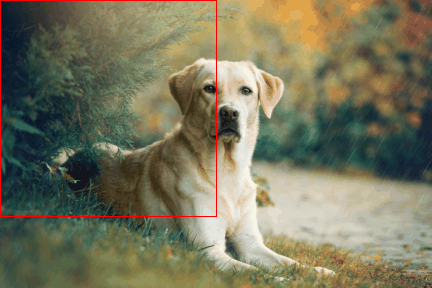

# Object detection: a YOLO implementation

## Learn to localize a single object

Assume to have a single (or none) object of interest per image in our dataset out of $n$ possible object classes. For instance, say we want to localize a dog in the following image:

One way to extend image classification to also localize the object is to define the following variables associated to the bounding box localizing the object:

- the *center* of the bounding box, ($b_x$, $b_y$)
- the *height* ($b_h$) and *width* ($b_w$) of the box

In addition to spatial properties we define:

- $p_c$ as the probability of an object to be present (either 1 or 0 in the training set)
- $[C_1, \ldots, C_n]$ a one-hot reresentation of the $n$ possible classes.

We can then finally model our target variable $y$ as follows:

$$
y = \begin{bmatrix}
        p_{c} \\
        b_{x} \\
        b_{y} \\
        b_{h} \\
        b_{w} \\
        C_{1} \\
        \vdots \\
        C_n
        \end{bmatrix}
$$

We assume that $[b_{x}, b_{y}, b_{h}, b_{w} , C_{1}, \ldots, C_n]$ are not relevant if $p_c = 0$ (only background is present); this is possible if the loss function has a functional form explicitly depending on $p_c$,

$$
L(y, \hat{y}) = \theta(y^0)f(y, \hat{y}) + (1 - \theta(y^0)) g(y^0, \hat{y}^0). 
$$

For instance, we might cast the loss as $L_2$ norm,

$$
L(y, \hat{y}) = \begin{cases} 
      ||y - \hat{y}||^2, & y^0 ( = p_c) = 1 \\
      (y^0 - \hat{y}^0)^2, & y^0 ( = p_c) = 0
   \end{cases}
$$

## Try to localize multiple objects: sliding windows

## Papers:

- [OverFeat: Integrated Recognition, Localization and Detection using Convolutional Networks - Pierre Sermanet, David Eigen, Xiang Zhang, Michael Mathieu, Rob Fergus, Yann LeCun, 2014](https://arxiv.org/abs/1312.6229)
- [You Only Look Once: Unified, Real-Time Object Detection - Joseph Redmon, Santosh Divvala, Ross Girshick, Ali Farhadi, 2015](https://arxiv.org/abs/1506.02640)